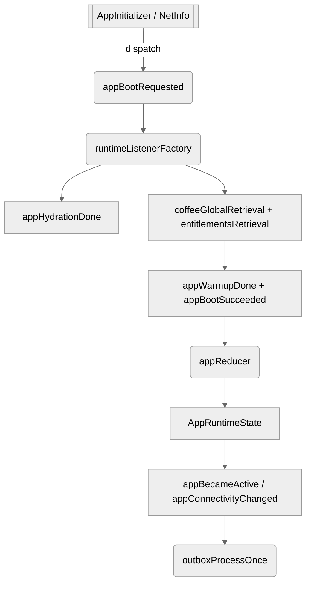

# App Context (WL)

Ce bounded context orchestre le cycle de vie global de l'app côté client : phase (`cold`, `booting`, `ready`…), disponibilité réseau et jalons de boot. Il expose :

- Un **state runtime** décrit dans `typeAction/appWl.type.ts` (phase, dernière activité, statut réseau et drapeaux de boot).【F:app/core-logic/contextWL/appWl/typeAction/appWl.type.ts†L1-L16】
- Un **réducteur** `appReducer` qui réagit aux actions de bootstrap/hydratation/connectivité pour mettre à jour ces indicateurs en temps réel.【F:app/core-logic/contextWL/appWl/reducer/app.reducer.ts†L4-L35】
- Un **listener middleware** `runtimeListenerFactory` qui écoute `appBootRequested`, hydrate Redux, précharge les cafés/entitlements puis déclenche l'outbox dès que l'appli devient active ou repasse online.【F:app/core-logic/contextWL/appWl/usecases/runtimeListener.ts†L1-L55】【F:app/core-logic/contextWL/appWl/usecases/runtimeListener.ts†L55-L76】

## Flux event-driven

Voir `appFlow.mmd` pour le déroulé complet. Résumé :

1. `AppInitializer` déclenche `appBootRequested`.
2. `runtimeListenerFactory` enchaîne `appHydrationDone` → `coffeeGlobalRetrieval` → `entitlementsRetrieval` puis publie `appWarmupDone`/`appBootSucceeded`.
3. Chaque transition (`appBecameActive`, `appConnectivityChanged`) rappelle `outboxProcessOnce` pour redrainer les commandes réseau.
4. Le reducer garde une trace des timestamps (`lastActiveAt`, `lastOnlineAt`) pour piloter la fraîcheur des autres contexts.

