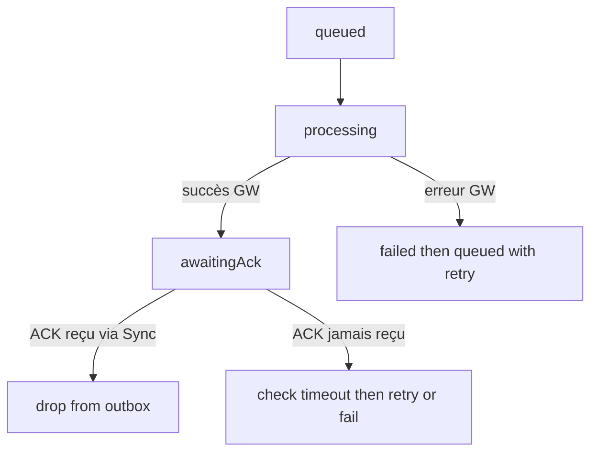

## 📘 `app/core-logic/contextWL/outboxWl/README.md`

> **OutboxWl = cœur métier de l’architecture offline first / optimistic UI.**
> Ce module ne gère pas le réseau lui-même, il structure *comment* on exprime, enfile et suit les commandes utilisateur.

---

# 🌱 Vision générale

`outboxWl` est le **bounded context** chargé de représenter et suivre les **commandes en attente d’envoi** :

* likes
* commentaires
* vérification de tickets

Il ne sait pas **comment** ces commandes sont envoyées (c’est le rôle du runtime dans `runtime/processOutbox.ts`),
mais il définit :

* le **modèle** des commandes et des undo,
* la **forme** de l’état outbox,
* la **façon dont on enfile** une commande (`enqueueCommitted`),
* la **façon dont on suit sa vie** (queued, processing, awaitingAck, failed…).

On peut voir `outboxWl` comme un **petit Event Store spécialisé sur les commandes client**.

---

# 🧩 Modèle métier

## Types principaux

Fichier : `typeAction/outbox.type.ts`

```ts
export type OutboxRecord = {
  id: string;           // outboxId interne
  item: OutboxItem;     // { command, undo }
  status: StatusType;
  attempts: number;
  lastError?: string;
  enqueuedAt: string;
  nextCheckAt?: string;
  nextAttemptAt?: number;
};

export type OutboxStateWl = {
  byId: Record<string, OutboxRecord>;
  queue: string[];             // ordre de traitement
  byCommandId: Record<string, string>;  // commandId → outboxId
};
```

### Commande + Undo

```ts
export type OutboxItem = {
  command: OutboxCommand;
  undo: OutboxUndo;
};
```

Les unions couvrent tous les types métier supportés :

```ts
export type OutboxCommand =
  | LikeAddCommand
  | LikeRemoveCommand
  | CommentCreateCommand
  | CommentUpdateCommand
  | CommentDeleteCommand
  | TicketVerifyCommand;

export type OutboxUndo =
  | LikeAddUndo
  | LikeRemoveUndo
  | CommentCreateUndo
  | CommentUpdateUndo
  | CommentDeleteUndo
  | TicketVerifyUndo;
```

Chaque commande porte toujours un **commandId** unique (string branded `CommandId`)
qui permet :

* l’**idempotence côté serveur**,
* la **reconnaissance locale** pour les ACK,
* le mapping `byCommandId` dans l’outbox.

### Kinds et statuts

```ts
export const commandKinds = {
  CommentCreate:  "Comment.Create",
  CommentUpdate:  "Comment.Update",
  CommentDelete:  "Comment.Delete",
  CommentRetrieve:"Comment.Retrieve",
  LikeAdd:        "Like.Add",
  LikeRemove:     "Like.Remove",
  TicketVerify:   "Ticket.Verify",
} as const;

export const statusTypes = {
  queued:      "queued",
  processing:  "processing",
  succeeded:   "succeeded",
  failed:      "failed",
  awaitingAck: "awaitingAck",
} as const;
```

Les **statuts** sont pilotés côté runtime (`processOutboxFactory`), mais ils font partie du **contrat métier** de l’outbox :

* `queued` : la commande est en file d’attente locale.
* `processing` : un envoi est en cours via un gateway.
* `awaitingAck` : la commande a été envoyée, on attend l’ACK serveur.
* `failed` : la dernière tentative a échoué (rollback local effectué).
* `succeeded` : éventuellement utilisé si on souhaite marquer explicitement les commandes “terminées” (dans les faits, en pratique, on les défile et on s’appuie sur les events serveur).

---

# 📥 Enqueue : entrée dans l’outbox

Les commandes sont enfilées via une action **commune** :

```ts
// commentWl/usecases/write/commentCreateWlUseCase.ts
export const enqueueCommitted = createAction<{
  id: string;
  item: OutboxItem;
  enqueuedAt: string;
}>("OUTBOX/ENQUEUE_COMMITTED");
```

C’est cet événement qui sert de **porte d’entrée** à l’outbox, quel que soit le bounded context émetteur (likeWl, commentWl, ticketWl…).

Le reducer `outboxWlReducer` gère le scénario métier :

```ts
.addCase(enqueueCommitted, (state, action) => {
  const { id, item, enqueuedAt } = action.payload;
  const cmdId = item.command.commandId;

  // déjà vu → ignore (idempotent côté client)
  if (state.byCommandId[cmdId]) return;

  state.byId[id] = {
    id,
    item,
    status: statusTypes.queued,
    attempts: 0,
    enqueuedAt,
  };
  state.queue.push(id);
  state.byCommandId[cmdId] = id;
});
```

### Invariants garantis par l’enqueue

* Chaque `commandId` est enfilé **au plus une fois**.
* `queue` reflète l’ordre d’arrivée des commandes.
* `byId` contient l’enregistrement détaillé.
* `byCommandId` permet de retrouver rapidement un outboxId à partir d’un commandId (utile pour les ACK).

---

# 🔁 Cycle de vie d’une commande (vue métier)

Même si l’implémentation concrète est gérée dans `runtime/processOutbox.ts`, le **cycle d’état** est un concept métier de `outboxWl` :



* **queued** : créée par `enqueueCommitted`.
* **processing** : la commande est prise en charge par le runtime et envoyée au gateway.
* **awaitingAck** : on attend un événement serveur (via Sync) qui confirme ce qui a été fait.
* **drop** : quand l’ACK arrive, un listener métier (likeWl, commentWl, ticketWl) consomme l’event serveur et appelle une action de drop (`dropCommitted`) pour purger l’outbox.

---

# 🧱 Reducer et actions importantes

Fichier : `reducer/outboxWl.reducer.ts`

Ce reducer implémente quelques règles métier importantes :

### `markProcessing`

```ts
.addCase(markProcessing, (state, action) => {
  const r = state.byId[action.payload.id];
  if (!r || r.status === statusTypes.processing) return;
  r.status = statusTypes.processing;
  r.attempts += 1;
  if ("nextAttemptAt" in r) delete (r as any).nextAttemptAt;
});
```

* protège contre les **double processing**
* incrémente le nombre d’essais

### `markFailed` + `scheduleRetry`

```ts
.addCase(markFailed, (state, action) => {
  const { id, error } = action.payload;
  const r = state.byId[id];
  if (!r) return;
  r.status = statusTypes.failed;
  r.lastError = error;
})
.addCase(scheduleRetry, (state, action) => {
  const { id, nextAttemptAt } = action.payload;
  const r = state.byId[id];
  if (!r) return;
  r.status = statusTypes.queued;
  (r as any).nextAttemptAt = nextAttemptAt;
});
```

* en cas d’erreur GW, on stocke `lastError` pour debug
* le backoff est calculé côté runtime, mais la **trace** reste dans l’outbox

### `markAwaitingAck`

```ts
.addCase(markAwaitingAck, (state, action) => {
  const { id, ackBy } = action.payload;
  const rec = state.byId[id];
  if (!rec) return;
  rec.status = statusTypes.awaitingAck;
  rec.nextCheckAt = ackBy;
});
```

* la commande est envoyée, on trace **jusqu’à quand** on attend un ACK (`nextCheckAt`)

### `dequeueCommitted` vs `dropCommitted`

```ts
.addCase(dequeueCommitted, (state, action) => {
  const { id } = action.payload;
  state.queue = state.queue.filter((x) => x !== id);
})
.addCase(dropCommitted, (state, action) => {
  const { commandId } = action.payload;
  const r = state.byCommandId[commandId];
  if (!r) return;
  delete state.byId[r];
  delete state.byCommandId[commandId];
});
```

* `dequeueCommitted` : enlève l’ID de la queue (on ne le traitera plus dans cette boucle)
* `dropCommitted` : supprime complètement la commande des structures `byId` et `byCommandId`
  → typiquement appelé **après un ACK serveur réussi**.

### `outboxRehydrateCommitted`

```ts
.addCase(outboxRehydrateCommitted, (state, action) => {
  const snap = action.payload ?? {};
  return {
    byId: snap.byId ?? {},
    queue: Array.isArray(snap.queue)
      ? snap.queue.filter((id: string) => !!snap.byId?.[id])
      : [],
    byCommandId: snap.byCommandId ?? {},
  };
})
```

* recharge un snapshot (déjà sanitisé par `rehydrateOutbox`)
* **garantie** : la queue ne contient que des IDs présents dans `byId`.

---

# 🔗 Interaction avec les autres bounded contexts

### Écriture

* `likeWl/usecases/write/likePressedUseCase`
* `commentWl/usecases/write/commentCreateWlUseCase`
* `ticketWl/usecases/write/ticketSubmitWlUseCase`

Un use case d’écriture typique :

1. met à jour **optimistiquement** son state local (like, commentaire, ticket…),
2. construit un `OutboxItem` : `{ command, undo }`,
3. génère un `commandId` et un `outboxId`,
4. dispatch `enqueueCommitted({ id, item, enqueuedAt })`.

### Lecture / ACK

Les ACKs sont gérés dans les BC concernés :

* `likeWl/usecases/read/ackLike.ts`
* `commentWl/usecases/read/ackReceivedBySocket.ts`
* `ticketWl/usecases/read/ackTicket.ts`

Ils sont alimentés par le **listener de sync** (`syncEventsListenerFactory`), qui route les `SyncEvent`:

* `like.addedAck` → `onLikeAddedAck`
* `comment.createdAck` → `onCommentCreatedAck`
* etc.

C’est à ce moment-là que le **drop** de l’outbox se produit (via `dropCommitted`), une fois que le read model local est aligné avec le serveur.

---

# ❌ Ce que `outboxWl` ne fait PAS

Pour bien séparer les responsabilités, le **bounded context outboxWl (métier)** ne fait **pas** :

* pas de décision de **quand** traiter la queue → `processOutboxFactory` + appWl
* pas de backoff, ni de retry → runtime
* pas de persistance → `outboxPersistenceMiddlewareFactory`
* pas de sanitize → `rehydrateOutboxFactory`
* pas de sync avec le serveur → `syncRuntimeListenerFactory` et `syncEventsListenerFactory`

👉 Ces aspects sont documentés dans le README de `outboxWl/runtime`.

---

# 🧪 Philosophie de tests côté métier

Les tests autour d’outbox côté métier vérifient :

* que `enqueueCommitted` respecte les invariants de l’état (`byId`, `queue`, `byCommandId`),
* que les transitions de statuts (queued → processing → awaitingAck → drop) sont cohérentes,
* que le mapping `commandId` → `outboxId` permet de faire le lien local avec les événements serveur.

Les tests d’intégration plus complets (avec gateways fake, rollback, backoff, etc.) vivent dans les specs de runtime (`processOutboxFactory`, `sync…`).

---

# 🧾 TL;DR

* `outboxWl` définit **comment une commande client existe dans le domaine**.
* Il offre une API claire : **enfiler, suivre, nettoyer** les commandes.
* Toute la mécanique d’exécution (réseau, retry, hydrate, sync) est externalisée dans `runtime/`.
* C’est une brique centrale pour garantir :

   * une UX fluide (optimistic),
   * une vraie résilience offline,
   * une architecture claire (ports/adaptateurs, DDD).

---
