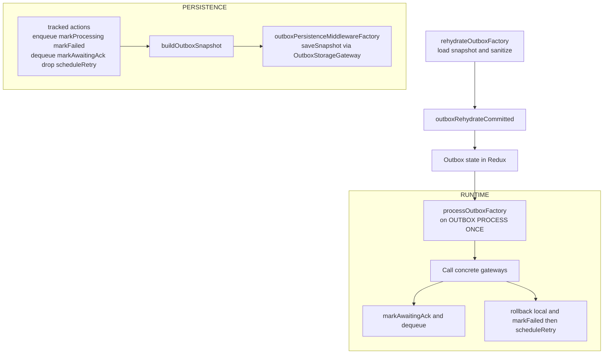

---

# ⚙️ `outboxWl/runtime` — moteur d’exécution, hydratation et persistance

Ce dossier contient **toute la mécanique runtime** autour de l’outbox :

* **chargement** depuis le stockage persistant,
* **sanitisation** des données,
* **exécution** des commandes une par une,
* **rollback** en cas d’erreur,
* **backoff exponentiel** et retry,
* **persistance** de l’état outbox.

La logique métier “pure” (commande, undo, statuts, mapping commandId → outboxId) est documentée dans
`outboxWl/README.md`.
Ici, on s’intéresse à **comment la machine tourne réellement**.

---

## 🧱 Composants principaux

### 1. `rehydrateOutboxFactory.ts`

Responsabilité :

* lire un snapshot persistant via `OutboxStorageGateway`,
* **sanitiser** complètement le snapshot (types, champs),
* dispatch `outboxRehydrateCommitted` pour remettre l’état dans Redux,
* renvoyer le snapshot sanitisé.

Signature :

```ts
type RehydrateOutboxDeps = {
  storage: OutboxStorageGateway;
  logger?: (message: string, payload?: unknown) => void;
};

export const rehydrateOutboxFactory = ({ storage, logger }: RehydrateOutboxDeps) => { ... }
```

Contrat du storage :

```ts
export interface OutboxStorageGateway {
  loadSnapshot(): Promise<OutboxStateWl | null>;
  saveSnapshot(snapshot: OutboxStateWl): Promise<void>;
  clear(): Promise<void>;
}
```

Sanitisation :

* `sanitizeRecord` vérifie :

    * `id` string,
    * `item.command` et `item.undo` objets,
    * `status` parmi les `statusTypes`,
    * `attempts` nombre fini,
    * `enqueuedAt` et `nextAttemptAt` cohérents,
* `sanitizeOutboxState` :

    * nettoie `byId`,
    * garde dans `queue` uniquement des strings,
    * nettoie `byCommandId` (valeurs string),
* en cas d’erreur de lecture (`loadSnapshot()` qui throw) :

    * log via `logger`,
    * retourne **un état vide**.

Réhydratation dans Redux :

```ts
store.dispatch(outboxRehydrateCommitted(sanitized));
```

Le reducer `outboxRehydrateCommitted` applique une dernière couche de sécurité :
il filtre les ids de `queue` qui n’ont pas de `byId` correspondant.

---

### 2. `outboxPersistenceFactory.ts`

Responsabilité :

* écouter toutes les actions qui **modifient l’outbox**,
* reconstruire un snapshot propre (`buildOutboxSnapshot`),
* persister le snapshot **avec un léger debounce** pour éviter d’écrire trop souvent.

Actions suivies :

```ts
const trackedActions = [
  enqueueCommitted,
  markProcessing,
  markFailed,
  dequeueCommitted,
  markAwaitingAck,
  dropCommitted,
  scheduleRetry,
];
```

À chaque action matchée :

```ts
startListening({
  matcher: isAnyOf(...trackedActions),
  effect: async (_, api) => {
    await persistSnapshot(api, deps);
  },
});
```

où `persistSnapshot` :

* lit l’état global,
* sélectionne `selectOutbox(root)`,
* construit un snapshot safe via `buildOutboxSnapshot(state)`,
* appelle `storage.saveSnapshot(snapshot)` après un timeout de 75 ms (debounce).

`buildOutboxSnapshot` :

```ts
export const buildOutboxSnapshot = (state: OutboxStateWl): OutboxStateWl => {
  const safeState: OutboxStateWl = {
    byId: state.byId ?? {},
    byCommandId: state.byCommandId ?? {},
    queue: Array.isArray(state.queue) ? state.queue : [],
  };
  return JSON.parse(JSON.stringify(safeState)) as OutboxStateWl;
};
```

En cas d’erreur sur `saveSnapshot` :

* on log via `deps.logger("[outbox] failed to persist", error)`
* **on ne crash pas** l’app ni le middleware.

---

### 3. `processOutbox.ts` — l’exécuteur de commandes

C’est le **moteur d’exécution** de l’outbox : il prend une commande en `queued`, la traite, puis :

* la marque en `awaitingAck` et la sort de la queue en cas de succès,
* ou applique un **rollback métier** et planifie un **retry** en cas d’erreur.

#### API

```ts
export const outboxProcessOnce = createAction("OUTBOX/PROCESS_ONCE");
```

Action dispatchée par :

* `appWl` au boot et au foreground,
* `NetInfo` adapter lors d’une reconnexion,
* éventuellement d’autres triggers.

Factory :

```ts
export const processOutboxFactory = (deps: DependenciesWl, callback?: () => void) => {
  const processOutboxUseCase = createListenerMiddleware();
  const listener = processOutboxUseCase.startListening as TypedStartListening<AppStateWl, AppDispatchWl>;

  listener({
    actionCreator: outboxProcessOnce,
    effect: async (action, api) => {
      // ...
    },
  });

  return processOutboxUseCase;
};
```

`DependenciesWl` fournit :

* `deps.gateways.likes`
* `deps.gateways.comments`
* `deps.gateways.tickets`
* `deps.helpers.currentUserId?`
* `deps.helpers.nowPlusMs?`
* etc.

#### Sélection de la commande à traiter

```ts
const state = api.getState() as AppStateWl;
const queue = selectOutboxQueue(state);
if (!queue.length) return;

const byId = selectOutboxById(state);
const now  = Date.now();

const eligibleId = queue.find((qid) => {
  const rec = byId[qid];
  if (!rec) return false;
  if (rec.status !== statusTypes.queued) return false;
  if (rec.nextAttemptAt && rec.nextAttemptAt > now) return false;
  return true;
});

if (!eligibleId) return;
```

* la boucle est **non bloquante** : un seul élément par `outboxProcessOnce`,
* si le record associé à l’id n’existe plus : `dequeueCommitted` pour nettoyer la queue.

#### Routing vers le bon gateway

```ts
const need = (k: string) => {
  switch (k) {
    case commandKinds.LikeAdd:
    case commandKinds.LikeRemove:
      return deps.gateways?.likes;
    case commandKinds.CommentCreate:
    case commandKinds.CommentUpdate:
    case commandKinds.CommentDelete:
      return deps.gateways?.comments;
    case commandKinds.TicketVerify:
      return deps.gateways?.tickets;
    default:
      return null;
  }
};

const gw = need(cmd.kind as any);

if (!gw) {
  api.dispatch(markFailed({ id, error: "no GW" }));
  api.dispatch(dequeueCommitted({ id }));
  api.dispatch(dropCommitted({ commandId: cmd.commandId }));
  return;
}
```

* si aucun gateway n’est trouvé : on marque en `failed`, on **défile** et on **drop** la commande.

#### Succès : awaitingAck et dequeue

Exemples :

```ts
case commandKinds.LikeAdd: {
  const userId = cmd.userId ?? deps.helpers?.currentUserId?.() ?? "anonymous";
  await deps.gateways.likes!.add(...);
  const ackBy = deps.helpers.nowPlusMs?.(30_000) ?? new Date(Date.now()+30_000).toISOString();
  api.dispatch(markAwaitingAck({ id, ackBy }));
  api.dispatch(dequeueCommitted({ id }));
  break;
}
```

Même pattern pour :

* `LikeRemove`
* `CommentCreate`
* `CommentUpdate`
* `CommentDelete`
* `TicketVerify`

**Invariants :**

* une commande **succès** quitte la queue (`dequeueCommitted`),
* reste en `byId` + `byCommandId` (en `awaitingAck`) jusqu’au drop déclenché par l’ACK côté Sync.

#### Erreurs : rollback + failed + retry

En cas d’exception dans le bloc `try` :

```ts
} catch (e: any) {
  const item = record.item as OutboxItem;

  switch (item.command.kind) {
    case commandKinds.LikeAdd:
    case commandKinds.LikeRemove: {
      const u = item.undo as LikeUndo;
      api.dispatch(likeRollback({ ...u }));
      break;
    }
    case commandKinds.CommentCreate: {
      const u = item.undo as { tempId: string; targetId: string; parentId?: string };
      api.dispatch(createRollback({ tempId: u.tempId, targetId: u.targetId, parentId: u.parentId }));
      break;
    }
    case commandKinds.CommentUpdate: {
      const u = item.undo as { commentId: string; prevBody: string; prevVersion?: number };
      api.dispatch(updateRollback({ ...u }));
      break;
    }
    case commandKinds.CommentDelete: {
      const u = item.undo as { commentId: string; prevBody: string; prevVersion?: number; prevDeletedAt?: string };
      api.dispatch(deleteRollback({ ...u }));
      break;
    }
    case commandKinds.TicketVerify: {
      const u = item.undo as { ticketId: string };
      api.dispatch(ticketRollBack({ ticketId: u.ticketId }));
      break;
    }
    default:
      break;
  }

  api.dispatch(markFailed({ id, error: String(e?.message ?? e) }));

  const stateAfterFail = api.getState() as AppStateWl;
  const attemptsSoFar = selectOutboxById(stateAfterFail)[id]?.attempts ?? 0;

  const base = Math.min(60_000, 2 ** Math.min(attemptsSoFar, 6) * 1000);
  const jitter = Math.floor(Math.random() * 300);
  const next = Date.now() + base + jitter;

  api.dispatch(scheduleRetry({ id, nextAttemptAt: next }));
}
```

* rollback **local** via les actions métier (`likeRollback`, `createRollback`, etc.),
* `markFailed` stocke l’erreur,
* `scheduleRetry` remet la commande en `queued` avec `nextAttemptAt` dans le futur.

Backoff :

* base = min(60 secondes, 2^attempts * 1000)
* jitter ∈ [0; 300ms]

---

## 🔍 Vue d’ensemble runtime



---

## 🧪 Philosophie de tests

Les tests couvrent :

* `processOutboxFactory` :

    * LikeAdd / LikeRemove / CommentCreate / Update / Delete / TicketVerify
    * happy path : `queued → processing → awaitingAck + dequeue`
    * error path : rollback + `failed` + `queued` avec retry
    * commandes inconnues : drop soft (pas de fail)
* `outboxPersistenceMiddlewareFactory` :

    * snapshot bien construit et persisté sur les actions trackées,
    * pas de persistance sur `outboxRehydrateCommitted`,
    * log sans crash en cas d’erreur de `saveSnapshot`.
* `rehydrateOutboxFactory` :

    * snapshot sanitisé correctement,
    * queue filtrée en accord avec `byId` dans le reducer,
    * fallback propre en cas d’erreur de `loadSnapshot`.

---

## 🧾 TL;DR

* `rehydrateOutboxFactory` : remet l’outbox en mémoire, proprement.
* `outboxPersistenceMiddlewareFactory` : garde l’outbox durable, sans surcharger le stockage.
* `processOutboxFactory` : fait tourner la machine commande par commande, avec :

    * sélection des commandes éligibles,
    * routing vers les bons gateways,
    * gestion des statuts,
    * rollback en cas d’erreur,
    * backoff exponentiel + jitter.

Le tout est orchestré par `appWl` et intégré dans un pipeline complet avec `syncRuntime` et `syncEventsListener` côté SYNC.

---

