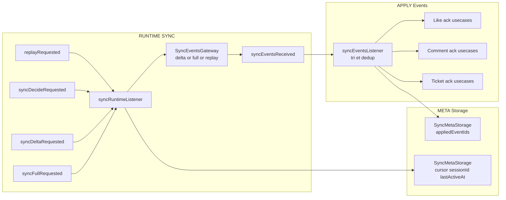

---

# 🌐 SYNC runtime — syncRuntimeListener + syncEventsListener

> **Objectif :** garder le client aligné avec le serveur, de manière efficace, résiliente et idempotente.

La partie SYNC du module `outboxWl` se compose de **deux pièces complémentaires** :

1. `syncRuntimeListenerFactory.ts`
   → décide *quand* et *comment* interroger le serveur (`delta` vs `full`), gère le `cursor`, le `sessionStamp`, le `replayLocal`, etc.

2. `syncEventsListenerFactory.ts`
   → consomme les `SyncEvent` reçus, les applique aux bounded contexts métier (likes, comments, tickets), et garantit qu’un event donné **n’est appliqué qu’une seule fois**, même en cas de replay ou de redémarrage de l’app.

Ces deux briques reposent sur des ports clairs :

* `SyncEventsGateway`
* `SyncMetaStorage`

---

## 🧱 Ports principaux

### `SyncEventsGateway`

Interface côté réseau :

```ts
export interface SyncEventsGateway {
  replayLocal(): Promise<{ events: SyncEvent[] }>;
  syncDelta(args: { cursor: string | null }): Promise<SyncResponse>;
  syncFull(): Promise<SyncResponse>;
}
```

* `replayLocal` : relit les événements déjà stockés localement.
* `syncDelta` : demande au serveur les événements **depuis un cursor**.
* `syncFull` : permet de refaire une synchronisation complète (sans cursor).

`SyncResponse` contient typiquement :

* `events: SyncEvent[]`
* `cursor: string | null`
* `sessionId: string`

### `SyncMetaStorage`

Stocke les métadonnées nécessaires au SYNC :

* `cursor`       : jusqu’où on a consommé le flux serveur
* `sessionId`    : identifiant de la session serveur connue
* `lastActiveAt` : dernière activité connue pour ce client
* `appliedEventIds: string[]` : fenêtre des events déjà appliqués pour éviter les replays

API typique :

```ts
export interface SyncMetaStorage {
  loadOrDefault(): Promise<void>;
  getSnapshot(): {
    cursor?: string | null;
    sessionId?: string | null;
    lastActiveAt?: number | null;
    appliedEventIds: string[];
  };
  setCursor(cursor: string | null): Promise<void>;
  setSessionId(sessionId: string | null | undefined): Promise<void>;
  updateLastActiveAt(nowMs: number): Promise<void>;
  markEventsApplied(ids: string[], maxSize: number): Promise<void>;
}
```

---

## 🧠 Stratégie de sync : `syncStrategy.ts`

Fichier : `runtime/syncStrategy.ts`

Paramètres clés :

```ts
export const FIVE_MINUTES    = 5 * 60 * 1000;
export const THIRTY_MINUTES  = 30 * 60 * 1000;
export const MIN_INTERVAL    = 250; // anti spam
```

### Session stamp

```ts
export const defaultSessionStamp = (state: RootStateWl) => {
  const session = state?.aState?.session;
  if (!session) return undefined;
  return `${session.userId}:${session.tokens?.issuedAt ?? "0"}`;
};
```

Ce “stamp” permet :

* de détecter un **changement d’utilisateur ou de session**,
* de forcer un **full sync** en cas de mismatch.

### shouldSkip

```ts
export const shouldSkip = (lastSyncCompletedAt: number, now: number): boolean => {
  return now - lastSyncCompletedAt < MIN_INTERVAL;
};
```

→ évite de lancer plusieurs syncs en rafale dans une période ultra courte.

### resolveStrategy

```ts
export const resolveStrategy = (
  requested: RequestedStrategy,   // "decide" | "delta" | "full"
  metaStorage: SyncMetaStorage,
  sessionStamp: string | undefined,
  now: number,
): SyncStrategy => {              // "delta" | "full" | "deltaWithFallback"
  const meta = metaStorage.getSnapshot();
  if (requested === "full") return "full";
  if (!meta.cursor) return "full";

  const sessionChanged = Boolean(meta.sessionId && sessionStamp && meta.sessionId !== sessionStamp);
  const idleSince = meta.lastActiveAt ? now - meta.lastActiveAt : Number.POSITIVE_INFINITY;

  if (sessionChanged)                return "full";
  if (requested === "delta")         return "delta";
  if (!Number.isFinite(idleSince))   return "full";
  if (idleSince > THIRTY_MINUTES)    return "full";
  if (idleSince > FIVE_MINUTES)      return "deltaWithFallback";
  return "delta";
};
```

Résumé :

* **pas de cursor** → full
* session changée → full
* `decide` + inactivité > 30 min → full
* `decide` + 5 min < idle < 30 min → deltaWithFallback (delta, mais full si le cursor est inconnu)
* `decide` + idle court → delta

---

## ⚙️ `syncRuntimeListenerFactory` — tirer les événements du serveur

Fichier : `runtime/syncRuntimeListenerFactory.ts`

### Rôle

* décide **quand** lancer un sync,
* décide **quelle stratégie** utiliser (delta, full, deltaWithFallback),
* gère :

    * le `cursor`,
    * le `sessionId`,
    * le `lastActiveAt`,
    * le “throttling” via `shouldSkip`,
    * la **protection inFlight** pour éviter les syncs concurrents,
* dispatch `syncEventsReceived(events)` quand des events sont remontés.

### Triggers écoutés

```ts
replayRequested
syncDecideRequested
syncDeltaRequested
syncFullRequested
```

* `replayRequested` → relecture locale (`eventsGateway.replayLocal()`)
* `syncDecideRequested` → stratégie automatique (delta ou full)
* `syncDeltaRequested` → force un delta
* `syncFullRequested` → force un full

### Flow simplifié

1. `ensureLoaded()` : `metaStorage.loadOrDefault()` une seule fois.
2. si `requested === "decide"` et `shouldSkip` renvoie `true` → on ne lance rien.
3. si un sync est déjà `inFlight` → on attend sa fin puis on sort.
4. sinon :

    * on calcule la stratégie via `resolveStrategy`.
    * on lit le snapshot meta (cursor, sessionId, lastActiveAt).
    * on appelle `syncDelta` ou `syncFull` selon la stratégie.
    * en cas de `deltaWithFallback` + `CursorUnknownSyncError` :

        * on log,
        * on retente en `full`.
5. si des `events` sont reçus → `dispatch(syncEventsReceived(events))`.
6. on met à jour :

    * `metaStorage.setCursor(response.cursor ?? snapshotBefore.cursor)`
    * `metaStorage.updateLastActiveAt(now)`
    * `metaStorage.setSessionId(sessionStamp)`
7. on met à jour `lastSyncCompletedAt`.

En cas d’erreur réseau :

* on log via `logger?.("[sync] failed", error)`
* on ne crash pas l’app.

---

## 📡 `syncEventsListenerFactory` — appliquer les événements une seule fois

Fichier : `runtime/syncEventsListenerFactory.ts`

### Rôle

* écoute `syncEventsReceived`,
* trie les `SyncEvent` par `happenedAt`,
* **filtre** les events déjà appliqués grâce à `metaStorage.appliedEventIds`,
* route chaque event vers la bonne logique métier (like, comment, ticket),
* marque les events comme “appliqués” via `metaStorage.markEventsApplied`.

### Types d’événements pris en charge

```ts
like.addedAck
like.removedAck
comment.createdAck
comment.updatedAck
comment.deletedAck
ticket.confirmedAck
ticket.rejectedAck
```

Map vers les usecases :

```ts
like.addedAck      → onLikeAddedAck(payload)
like.removedAck    → onLikeRemovedAck(payload)
comment.createdAck → onCommentCreatedAck(payload)
comment.updatedAck → onCommentUpdatedAck(payload)
comment.deletedAck → onCommentDeletedAck(payload)
ticket.confirmedAck→ onTicketConfirmedAck(payload)
ticket.rejectedAck → onTicketRejectedAck(payload)
```

### Déduplication

À chaque `syncEventsReceived(events)` :

1. on lit le snapshot meta : `metaStorage.getSnapshot()`
2. on construit un `Set` des `appliedEventIds` existants.
3. on trie `events` par `happenedAt`.
4. pour chaque `evt` :

    * si `known.has(evt.id)` → on continue (déjà appliqué).
    * sinon → on route vers le BC cible et on ajoute `evt.id` à `known` et au tableau `newlyApplied`.
5. si `newlyApplied.length > 0` :

    * `metaStorage.markEventsApplied(newlyApplied, MAX_APPLIED_EVENT_IDS)`

`MAX_APPLIED_EVENT_IDS` (par exemple `2000`) définit une **fenêtre glissante** : on n’a pas besoin de garder toute l’histoire, seulement les derniers events appliqués.

---

## 🔍 Vue d’ensemble du pipeline SYNC



Lecture :

* `replayRequested` / `sync*Requested` viennent de `appWl` et des adapters `AppState` (foreground).
* `syncRuntimeListener` décide quoi faire côté réseau et dispatch `syncEventsReceived`.
* `syncEventsListener` applique les events, dans l’ordre, en évitant les doublons, et marque les ids appliqués.

---

## 🎯 Interaction avec outboxWl et appWl

* **appWl** déclenche :

    * au boot : `replayRequested` + `syncDecideRequested`
    * au foreground : `replayRequested` + `syncDecideRequested`
* **NetInfo adapter** :

    * ne parle pas directement à SYNC, mais déclenche `outboxProcessOnce`, qui en pratique est souvent suivi d’un `syncDecideRequested` côté appWl.
* **outboxWl** :

    * ne connaît pas SYNC directement,
    * les ACK serveur (likes, comments, tickets) déclenchés via SYNC sont consumés par les BC métiers, qui eux appellent les actions de drop de l’outbox (`dropCommitted`).

---

## 🧪 Philosophie de tests SYNC

### `syncRuntimeListener`

* vérifie que :

    * **delta** est appelé après une courte inactivité,
    * **full** est appelé :

        * quand le cursor est absent,
        * quand la session change,
        * après une longue inactivité,
    * **deltaWithFallback** bascule en full si un `CursorUnknownSyncError` est remonté,
    * `syncEventsReceived` est dispatché quand le gateway renvoie des événements,
    * `metaStorage` est mis à jour correctement (cursor, lastActiveAt, sessionId),
    * `shouldSkip` prévient les syncs trop rapprochés,
    * `inFlight` protège contre les syncs simultanés.

### `syncEventsListener`

* vérifie que :

    * les `SyncEvent` sont bien routés vers les actions métier (like, comment, ticket),
    * les `appliedEventIds` sont enrichis à chaque batch,
    * un event déjà **seedé** dans `appliedEventIds` n’est jamais rejoué,
    * un même event reçu deux fois n’est appliqué **qu’une seule fois**.

---

## 🧾 TL;DR

* `syncRuntimeListener` : **cerveau réseau** du SYNC
  → delta vs full, replay, sessionStamp, cursor, anti spam, retry fallback.

* `syncEventsListener` : **events applier idempotent**
  → trie, déduplique, applique une seule fois, mémorise les `appliedEventIds`.

Ensemble, ils fournissent un **pipeline SYNC robuste, testable et découplé** :

* résilient aux changements de session,
* tolérant aux erreurs de cursor,
* évitant les doubles applications,
* parfaitement plug-and-play avec tes bounded contexts métier.

---
